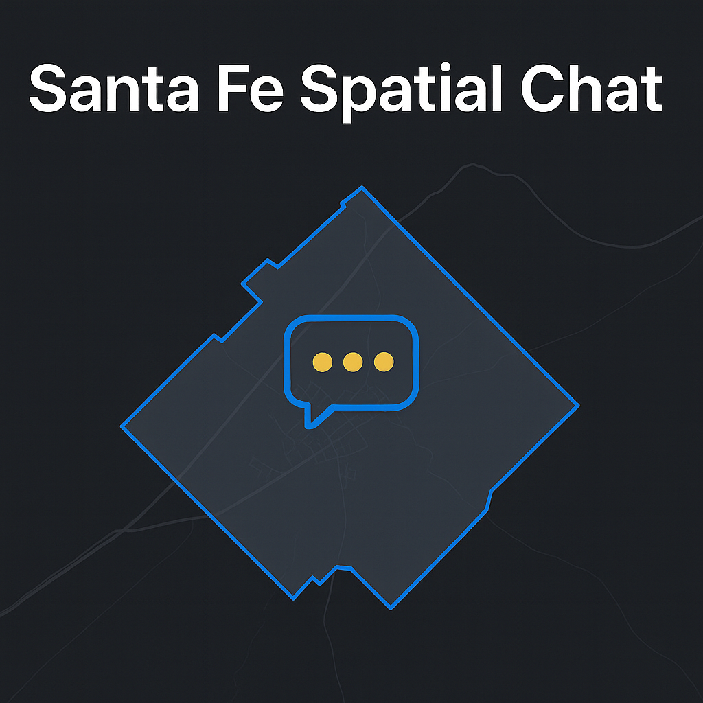

# Santa Fe Spatial Chat

**Ask questions about housing, land use, and equity in Santa Fe using plain English.**

Santa Fe Spatial Chat is a natural language interface for exploring spatial data about Santa Fe, New Mexico. Type a question like *"Show me vacant residential parcels within 500 meters of a bus stop"* and see the results on an interactive map with a plain-English explanation.




---

## Why This Project?

Santa Fe faces a housing crisis. Home prices have risen faster than incomes, short-term rentals have reduced available housing stock, and many residents struggle to find affordable places to live. Understanding *where* these problems occur—and how they intersect with transit access, zoning, flood risk, and neighborhood demographics—requires spatial analysis that's typically locked behind expensive GIS software and specialized expertise.

This tool aims to make that analysis accessible to anyone: residents, journalists, advocates, city planners, and policymakers. No GIS experience required—just ask your question.

### Questions you can ask

- "Which neighborhoods have the most short-term rentals?"
- "Show parcels zoned residential that are currently vacant"
- "Census tracts with median income below $40,000"
- "Affordable housing units within 800 meters of transit stops"
- "How has assessed value changed near the Railyard since 2018?"
- "Parcels within 500 meters of an arroyo and inside flood zones"

---

## Features

- **Natural language queries** — Ask questions in plain English; an LLM translates them to spatial queries
- **Interactive map** — Results displayed on a MapLibre GL map centered on Santa Fe
- **Transparent queries** — See exactly what spatial operation was executed, not just the results
- **Equity-aware explanations** — AI-generated summaries that consider demographic and equity context
- **Multiple data layers** — Parcels, census tracts, zoning, hydrology, transit, and more
- **Export results** — Download findings as GeoJSON or CSV for further analysis

---

## Demo

> *Coming soon* — The project is under active development. Check back for a live demo link.

---

## How It Works

```
┌─────────────────────────────────────────────────────────────┐
│  You type: "Residential parcels near the Santa Fe River"   │
└─────────────────────────────────────────────────────────────┘
                              │
                              ▼
┌─────────────────────────────────────────────────────────────┐
│  1. LLM parses your question into a structured query        │
│  2. Query validated against available layers/fields         │
│  3. Spatial SQL executed against DuckDB                     │
│  4. Results returned as GeoJSON + rendered on map           │
│  5. LLM generates plain-English explanation                 │
└─────────────────────────────────────────────────────────────┘
                              │
                              ▼
┌─────────────────────────────────────────────────────────────┐
│  "Found 34 residential parcels within 200m of Santa Fe     │
│   River segments, concentrated in the downtown and Agua    │
│   Fria areas. These overlap census tracts with median      │
│   incomes below the city average."                         │
└─────────────────────────────────────────────────────────────┘
```

Every query shows the structured operation that was executed, so you can verify what the system did and reproduce it.

---

## Tech Stack

| Component | Technology |
|-----------|------------|
| Frontend | React 18, TypeScript, Vite, MapLibre GL JS, TailwindCSS |
| Backend | Hono (TypeScript), Zod validation |
| Database | DuckDB with spatial extension |
| LLM | Ollama (local) or Together.ai/Groq (production) |
| Deployment | Railway/Fly.io (API), Vercel/Cloudflare Pages (frontend) |

### Why these choices?

- **DuckDB** — Single-file database with spatial support. No server to manage, ships with the app.
- **Hono** — Lightweight, edge-ready API framework. Fast and TypeScript-native.
- **MapLibre GL** — Open-source map rendering. No vendor lock-in.
- **Ollama** — Run LLMs locally during development. No API costs, no data leaves your machine.

---

## Data Sources

This project uses publicly available data about Santa Fe:

| Layer | Source | Description |
|-------|--------|-------------|
| Parcels | Santa Fe County Assessor | Property boundaries, zoning, assessed values |
| Census Tracts | US Census ACS | Demographics, income, housing characteristics |
| Hydrology | City/County GIS | Rivers, streams, arroyos, acequias |
| Zoning Districts | City of Santa Fe | Land use regulations |
| Transit | City transit GTFS | Bus routes and stops |
| Flood Zones | FEMA NFHL | Flood risk areas |

See [docs/DATA_SOURCES.md](docs/DATA_SOURCES.md) for complete documentation of data provenance, update cadence, and licensing.

---

## Local Development

### Prerequisites

- Node.js 20+
- [Ollama](https://ollama.ai/) installed and running
- Git

### Setup

```bash
# Clone the repository
git clone https://github.com/yourusername/santa-fe-spatial-chat.git
cd santa-fe-spatial-chat

# Install dependencies
cd api && npm install && cd ..
cd web && npm install && cd ..

# Pull an LLM model (choose one)
ollama pull qwen2.5:7b
# or
ollama pull llama3.1:8b

# Copy environment template
cp .env.example .env.local

# Start the API (in one terminal)
cd api && npm run dev

# Start the frontend (in another terminal)
cd web && npm run dev
```

The frontend runs at `http://localhost:5173` and the API at `http://localhost:3000`.

### Environment Variables

```bash
# .env.local (development)
LLM_PROVIDER=ollama
OLLAMA_BASE_URL=http://localhost:11434
OLLAMA_MODEL=qwen2.5:7b

# .env.production
LLM_PROVIDER=together
TOGETHER_API_KEY=your_api_key_here
```

---

## Project Structure

```
santa-fe-spatial-chat/
├── api/                    # Backend (Hono + DuckDB)
│   ├── src/
│   │   ├── routes/         # API endpoints
│   │   ├── lib/
│   │   │   ├── orchestrator/   # NL → query → results
│   │   │   ├── llm/            # LLM provider abstraction
│   │   │   └── db/             # DuckDB setup and queries
│   │   └── types/          # TypeScript types
│   └── data/               # GeoParquet data files
│
├── web/                    # Frontend (React + MapLibre)
│   ├── src/
│   │   ├── components/     # ChatPanel, MapView, ResultsPanel
│   │   ├── hooks/          # useChat, useMap
│   │   └── lib/            # API client
│   └── public/
│
├── shared/                 # Shared types between api/web
├── scripts/                # Data preparation scripts
└── docs/                   # Architecture and planning docs
```

---

## API Endpoints

| Endpoint | Method | Description |
|----------|--------|-------------|
| `/api/chat` | POST | Natural language query → results + explanation |
| `/api/query` | POST | Direct structured query (bypass LLM) |
| `/api/layers` | GET | Available data layers and their schemas |
| `/api/health` | GET | Service health check |

### Example: Natural Language Query

```bash
curl -X POST http://localhost:3000/api/chat \
  -H "Content-Type: application/json" \
  -d '{"message": "Show residential parcels near the river"}'
```

Response:
```json
{
  "query": {
    "selectLayer": "parcels",
    "attributeFilters": [{"field": "zoning", "op": "in", "value": ["R-1", "R-2"]}],
    "spatialFilters": [{
      "op": "within_distance",
      "targetLayer": "hydrology",
      "distance": 200
    }]
  },
  "result": {
    "type": "FeatureCollection",
    "features": [...],
    "metadata": {"count": 34, "executionTimeMs": 127}
  },
  "explanation": "Found 34 residential parcels within 200m of river segments...",
  "confidence": 0.9
}
```

---

## Contributing

This project is in early development. Contributions are welcome!

### Areas where help is needed

- **Data acquisition** — Sourcing and cleaning Santa Fe spatial datasets
- **Query patterns** — Expanding the types of spatial queries supported
- **UI/UX** — Improving the map interface and results display
- **Testing** — Unit and integration tests for the query builder
- **Documentation** — Improving this README and adding tutorials

### Development workflow

1. Fork the repository
2. Create a feature branch (`git checkout -b feature/your-feature`)
3. Make your changes
4. Run tests (`npm test` in both `api/` and `web/`)
5. Submit a pull request

Please ensure TypeScript compiles without errors (`npm run typecheck`) and linting passes (`npm run lint`).

---

## Roadmap

### In Progress
- [ ] Core query builder with spatial operations
- [ ] Basic chat interface
- [ ] Map rendering with results layer

### Planned
- [ ] Pre-built analysis templates (STR density, affordability gap, etc.)
- [ ] Aggregation queries (count by neighborhood, median by zone)
- [ ] Temporal comparisons (change over time)
- [ ] PDF report export for presentations
- [ ] Multi-turn conversation ("Now filter those to just the Southside")

### Future Ideas
- [ ] User-uploaded data layers
- [ ] Shareable query URLs
- [ ] Voice input for accessibility
- [ ] Comparison mode (side-by-side results)

---

## Documentation

- [Architecture](docs/ARCHITECTURE.md) — Technical design and system overview
- [Build Plan](docs/BUILD_PLAN.md) — Week-by-week development roadmap
- [Data Sources](docs/DATA_SOURCES.md) — Dataset provenance and licensing

---

## Acknowledgments

- Santa Fe County and City of Santa Fe for publishing open GIS data
- US Census Bureau for demographic data
- The open-source communities behind DuckDB, MapLibre, Hono, and Ollama

---

## License

MIT License. See [LICENSE](LICENSE) for details.

---

## Contact

Questions, ideas, or feedback? Open an issue or reach out:

- GitHub Issues: [github.com/yourusername/santa-fe-spatial-chat/issues](https://github.com/yourusername/santa-fe-spatial-chat/issues)

---

*Built with the goal of making spatial data accessible for housing equity research in Santa Fe, NM.*
